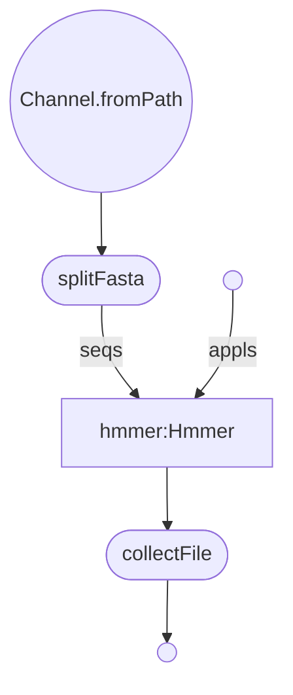

# hmmer
Containerized nextflow workflow to replace interproscan

```mermaid
flowchart TD
    p0((Channel.fromPath))
    p1([splitFasta])
    p2(( ))
    p3[hmmer:Hmmer]
    p4([collectFile])
    p5(( ))
    p0 --> p1
    p1 -->|seqs| p3
    p2 -->|appls| p3
    p3 --> p4
    p4 --> p5
```